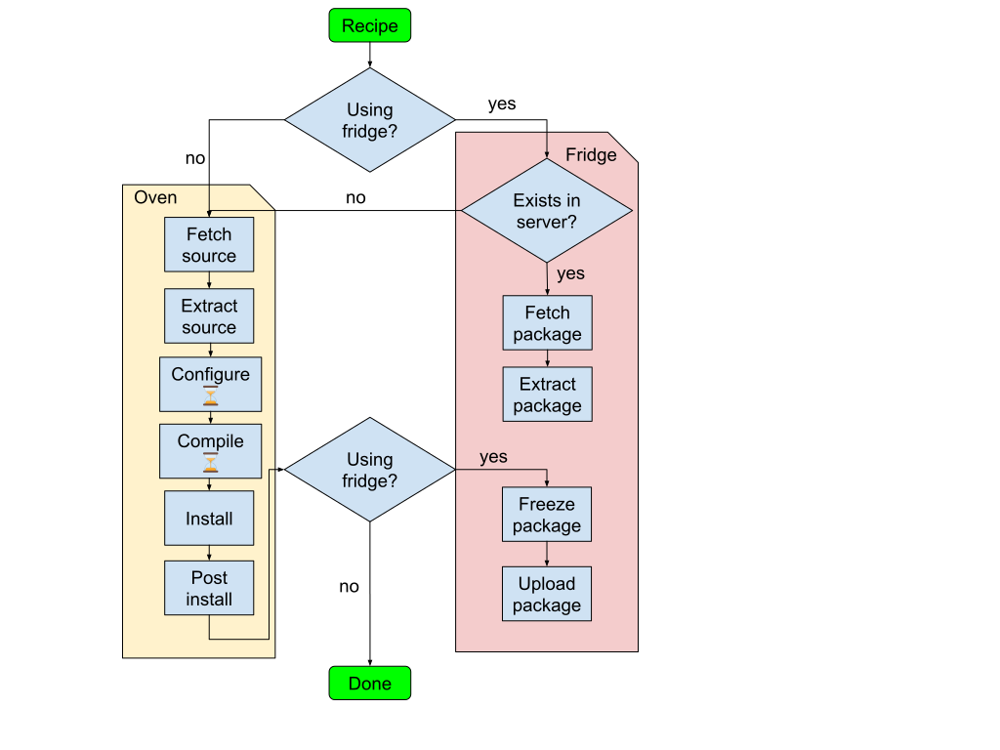

# Fridge

The fridge functionality of Cerbero aims to reduce the time taken to cook
recipes by freezing them once they are built and uploading their content to some
FTP server that acts as a fridge for the recipes. This way, we avoid the
configure and compile steps, which are arguably the most time-consuming ones.

## Diagram



## How recipes are reused

A hash is generated for the current environment used in the configuration. This
means everything that `config::get_env` considers plus the compiler version.
e.g. the linker flags, include dir, LD_LIBRARY_PATH, etc. Hence, the idea is to
reuse the same binaries already built in a conservative way to ensure they will
work. The environment is sanitized before creating the hash, so that the prefix,
Cerbero's home and user's home are normalized. Apart from that, the package
naming already contains the target platform and target architecture. A directory
is created for each of the configurations (aka. environments) where prebuilt
packages will live.

Apart from the environment hash, a hash is generated per recipe to allow having
different versions. The recipe hash is taken from a checksum of all the files
involving it (the recipe itself + patches), the version that it's using and in
case `strict_recipe_checksum` is set to True, also all its parent classes and
dependencies checksums. For recipes using a git repo as its source, their
version includes the commit it's based upon.

This is a comprehensive list that shows the changes that affect the package
name:

* The recipe content
* Any of the patches' content, or a new one is added
* The commit hash a recipe is pointing to
* If `strict_recipe_checksum=True`
  * Any of the non-builtin parent's classes of the recipe
  * Any of the recipe dependencies

# What is packaged

Initially, we had a *devel* and *release* version of each package and fridge was
using the same files that are specified in the recipes that need to be packaged.
It turned out to be very troublesome and difficult to maintain a list of files
needed for each recipe that is used during the bootstrap step for each OS. As a
consequence, a pragmatic approach was taken in which we only have *devel*
packages for each recipe which includes every single file that is actually
installed. This way, we ensure that what's packaged has everything needed. The
source code is prepared to switch to the *devel* + *release* flavours at any
point, though.

The installed files collection is done by gathering all the files that *install*
and *post_install* add or modify. This list of files is added to the cache into
a new `installed_files` member. This may be used in the future not only to know
which files fridge needs to package, but also to fully uninstall all the files a
recipe has added.

## How recipes are stored in the fridge

The fridge consists of a FTP server with write permissions granted so that the
client can create a different directory per configuration. This directory will
contain all the packages built for this specific configuration for all target
platforms and target architectures.

Every frozen recipe is uploaded along a sha256 files containing the hash of the
packages file. This file will be used on the local fridge to know whether the
remote one needs to be downloaded or not. In other words, the `binaries_local`
directory specified in the config acts as a local cache for the frozen recipes.

Additionally, every environment directory includes an `ENVIRONMENT` file
containing the list of all the variables considered to generate the hash:

```
9beba1f2

ACLOCAL=aclocal
ACLOCAL_FLAGS=-I{PREFIX}/share/aclocal
CC=clang
CC_VERSION=10.0.0
CFLAGS=-Wall -g -O2 -arch x86_64 -m64 -Wno-error=format-nonliteral -I{PREFIX}/include -mmacosx-version-min=10.10 -isysroot /Applications/Xcode.app/Contents/Developer/Platforms/MacOSX.platform/Developer/SDKs/MacOSX10.14.sdk
CPLUS_INCLUDE_PATH={PREFIX}/include
C_INCLUDE_PATH={PREFIX}/include
GI_TYPELIB_PATH={PREFIX}/lib/girepository-1.0
GSTREAMER_ROOT={PREFIX}
GST_PLUGIN_PATH={PREFIX}/lib/gstreamer-0.10
GST_PLUGIN_PATH_1_0={PREFIX}/lib/gstreamer-1.0
GST_REGISTRY={USER}/.gstreamer-0.10/cerbero-registry-x86_64
GST_REGISTRY_1_0={USER}/.cache/gstreamer-1.0/cerbero-registry-x86_64
INFOPATH={PREFIX}/share/info
LDFLAGS=-L{PREFIX}/lib -headerpad_max_install_names -Wl,-headerpad_max_install_names -Wno-error=unused-command-line-argument -arch x86_64 -m64 -Wl,-arch,x86_64 -mmacosx-version-min=10.10 -isysroot /Applications/Xcode.app/Contents/Developer/Platforms/MacOSX.platform/Developer/SDKs/MacOSX10.14.sdk
LD_LIBRARY_PATH={PREFIX}/lib:{PREFIX}/lib:{PREFIX}/bin:/opt/local/bin:/opt/local/sbin:/usr/local/bin:/usr/bin:/bin:/usr/sbin:/sbin:/usr/local/share/dotnet:~/.dotnet/tools:/Library/Frameworks/Mono.framework/Versions/Current/Commands:/Applications/Xamarin Workbooks.app/Contents/SharedSupport/path-bin
MANPATH={PREFIX}/share/man
MONO_GAC_PREFIX={PREFIX}
MONO_PATH={PREFIX}/lib/mono/4.5
PERL5LIB={PREFIX}/lib/perl5:{PREFIX}/lib/perl5/site_perl/5.18.2
PKG_CONFIG={PREFIX}/bin/pkg-config
PKG_CONFIG_LIBDIR={PREFIX}/lib/pkgconfig
PKG_CONFIG_PATH={PREFIX}/share/pkgconfig
PYTHONPATH={PREFIX}/lib/python3.7/site-packages/:{PREFIX}/lib/python3.7/site-packages/
XCURSOR_PATH={PREFIX}/share/icons
XDG_CONFIG_DIRS={PREFIX}/etc/xdg
XDG_DATA_DIRS={PREFIX}/share
```

The following directory contains the packages of yasm and zlib recipes for macOS
64bit, along with their sha256:

```
└── ffdfa03d
    ├── ENVIRONMENT
    ├── yasm-pkg-darwin-x86_64-1.3.0-aa98cab1-devel.tar.bz2
    ├── yasm-pkg-darwin-x86_64-1.3.0-aa98cab1-devel.tar.bz2.sha256
    ├── zlib-pkg-darwin-x86_64-1.2.11-dffcadaf-devel.tar.bz2
    ├── zlib-pkg-darwin-x86_64-1.2.11-dffcadaf-devel.tar.bz2.sha256
```

## How to use the fridge functionality

First, we need add the `binaries_remote` element into the configuration. e.g.:
`binaries_remote = FtpBinaryRemote('127.0.0.1:2121')`.

Apart from that, the following arguments have been added to the `build` and
`bootstrap` commands:

```
--use-binaries     use binaries from the repo before building
--upload-binaries  after a recipe is built upload the corresponding binary package
--fridge           equivalent to '--use-binaries --upload-binaries'
```

As a rule of thumb, if you want to use prebuilt binaries and upload any of them
that are not already present, you would use `--fridge`. Cerbero will
automatically use the ones that exist but build the ones who doesn't, uploading
them to the fridge if the option is given.
